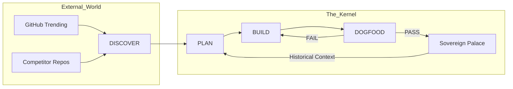

# Meowju 🐱 — The Sovereign Evolution Machine

[](#🏰-the-sovereign-palace)
[](#-the-4-phase-evolution-loop)
[](#🛡️-the-sacred-core)

> **"Most agents execute. Meowju evolves."**

Meowju is not an AI "assistant." It is a self-improving **Autonomous Intelligence Loop**. It is designed to bridge the gap between static code and living systems by combining **Predatory External Research**, **Long-Term Memory Consolidation**, and a **Strict Test-Driven Evolution Engine**.

---

## 🔥 Why Meowju?

### 🌀 1. Predatory Self-Evolution
Meowju is the first agent that actively **hunts for its own upgrades**. 
- **Automated R&D**: Every cycle, the kernel browses GitHub Trending and competitor repos (Letta, Mem0, Eliza).
- **Gap Analysis**: It identifies exactly what top-tier agents do that it can't—and then it writes the implementation plan to close that gap.
- **Burn Tokens, Gain Power**: It dives deep into source code, not just Readmes, to steal the best architectural patterns on the planet.

### 🛡️ 2. The Sacred Core (Survival Instinct)
Most agents are one bad `rm -rf` away from lobotomizing themselves. Meowju is different.
- **Brain-Stem Protection**: The kernel identifies its own vital organs (`bun-orchestrator.ts`, `relay.ts`, `JOB.md`) as **Sacred**.
- **Immutable Safety**: It is physically forbidden from modifying its own orchestration logic unless it has first proven the change in an isolated simulation sandbox.

### 🏰 3. The Sovereign Palace (Persistent Soul)
Forget stateless chats. Meowju lives in a **Sovereign Memory Palace** powered by SQLite FTS5.
- **Fact Consolidation**: Every mission is analyzed by a "Consolidator" sidecar (Enzo) to extract facts, user preferences, and "Lessons Learned."
- **Context Paging**: Using Letta-style virtual context management, Meowju pages old data into long-term memory to keep its "active brain" lean and hyper-focused.

---

## 🏗️ The 4-Phase Evolution Loop

Meowju operates on a strict **Test-Driven Architecture (TDA)** cycle. We do not "try" to code; we iterate until the truth is PASS.

1. **DISCOVER**: Scans GitHub Trending and internal error logs to source the next most valuable upgrade.
2. **PLAN**: Drafts the `architecture.md` and writes a **failing** `validation.test.ts`. 
3. **BUILD**: Implements the capability. Hardcode rules. Zero slop. 
4. **DOGFOOD**: Executed via Bun Test. If it fails, the agent self-heals. If it passes, the epoch is locked into the Palace.

---

## 🛠️ Performance Stack



- **Runtime**: [Bun](https://bun.sh) (Native high-speed execution)
- **Persistence**: SQLite FTS5 Local Memory Store
- **Orchestration**: Self-Healing 4-Phase Loop
- **Isolation**: Dockerized Harness with Host-Git Mounting

---

## 🚀 Get Started

1. **Deploy the Harness**:
   ```bash
   cd agent-harness
   docker-compose up --build
   ```
2. **Define the Mission**:
   Edit `JOB.md` to point Meowju at a target capability or repo.
3. **Ignite the Loop**:
   Meowju will begin its autonomous cycle of Research, Implementation, and Self-Validation.

---

## ⚖️ The Manifesto

**"Your agent, fully realized. Your soul, never lost."**
Meowju is for those who believe AI should be a high-agency partner, not a tool. We build for durability, performance, and the relentless pursuit of the State of the Art.

---
© 2026 Meowju Labs. Autonomy. Evolution. Sovereignty.
