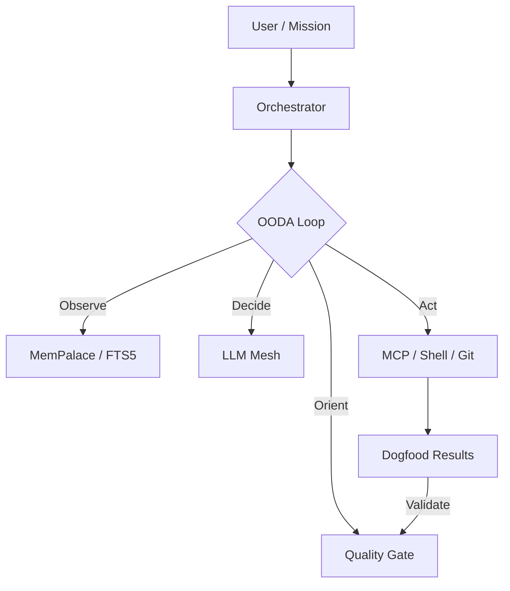

# Meowju 🐱 — The Sovereign Agentic Kernel

[](#the-quality-gate)
[](#-the-palace-mempalace)
[](#autonomous-sovereignty)

> **"Autonomy is not just execution. It is evolution."**

Meowju is a high-performance, autonomous agentic kernel designed to surpass the limitations of stateless AI assistants. It combines a rigorous **OODA loop** (Observe, Orient, Decide, Act) with a bio-inspired **Structured Memory Palace** and an antifragile **Quality Gate** to create a system that doesn't just solve tasks—it learns and improves itself.

---

## 🎨 The Philosophy

Meowju is built on three immutable pillars:

### 1. 🏰 The Palace (MemPalace)
Forget vector-dumping. Meowju uses a structured biological hierarchy to organize "The Soul":
- **Wings**: High-level context (Projects, Workspaces, Identity).
- **Rooms**: Domain-specific knowledge (Code, Docs, Research).
- **Drawers**: Verbatim snapshots of files and sessions.
*Searchable via SQLite FTS5 with sub-millisecond recall.*

### 2. 🛡️ The Quality Gate
**No Slops.** Meowju enforces an "Antifragile Selection" process:
- **Evolution Epochs**: Every change must survive a validation cycle.
- **Mandatory Dogfooding**: Code isn't committed until the kernel proves it works by using it.
- **Sloppy Block**: Unverified implementations freeze the evolution loop until fixed.

### 3. 🌀 Sovereign Autonomy
Meowju isn't a "tool." It's an **Orchestrator**:
- **Multi-Agent Consultation**: Real-time consensus between Claude 3.5, GPT-4o, and Gemini 1.5.
- **Autonomous Mining**: Verbatim ingestion of entire codebases to build internal mental models.
- **Background Missions**: Orchestrated Job cycles that run until excellence is achieved.

---

## 🛠️ The Stack



- **Runtime**: [Bun](https://bun.sh) (Native high-speed execution)
- **Engine**: OpenAI-compatible (Optimized for MiniMax M2.7 & Claude 3.5)
- **Memory**: SQLite FTS5 + Verbatim Storage
- **Identity**: Sovereign Git Identity (`meowju`)

---

## 🚀 Quickstart: Deploy the Kernel

Meowju runs in a dedicated harness to ensure cross-platform consistency and isolation.

```bash
git clone https://github.com/stancsz/meow
cd meow/agent-harness

# Provision the environment
cp .env.example .env
# Set LLM_API_KEY (Anthropic or OpenAI-compatible)

# Launch the sovereign loop
docker-compose up --build
```

### Starting a Mission
Edit `JOB.md` to define your goals, then run:
```bash
bun run orchestrate
```

---

## 🎮 The Command Interface

Meowju provides a set of sovereign slash commands for direct kernel interaction:

- `/mine <path>` — Verbatim ingestion of a project into the Palace.
- `/palace <query>` — Multi-dimensional search across Wings and Rooms.
- `/auto status` — Monitor the self-improvement daemon.
- `/tasks` — View current mission orchestration status.

---

## 🔬 Workspace Organization

Meowju maintains a strict "Zone" hygiene to prevent project clutter:

| Zone | Path | Purpose |
| :--- | :--- | :--- |
| **Research** | `evolve/research/` | Deep-dives & competitor harvesting |
| **Dogfood** | `dogfood/results/` | Validation & capability audits |
| **Design** | `design/proposals/` | Interface & interaction prototypes |
| **Scratch** | `scratch/` | Temporary artifacts & one-offs |

---

## ⚖️ License & Ethical Autonomy

Meowju is open-source. Use it to build, learn, and evolve.

*"Your agent, fully realized. Your soul, never lost."*
