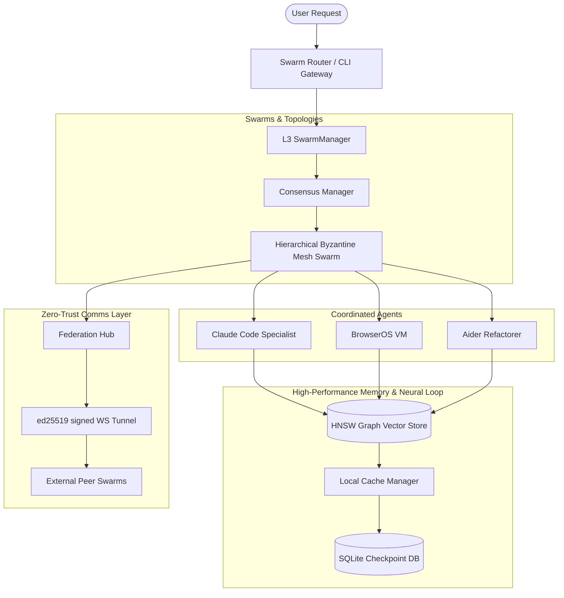

# 🐈 Meow-Swarm

[](https://opensource.org/licenses/MIT)
[](https://www.typescriptlang.org/)
[](https://vitest.dev/)

**Meow-Swarm** is an enterprise-grade, self-healing, quality-gated background coding harness and multi-agent federation swarm. Designed to execute complex programming tasks autonomously while you sleep, it leverages atomic transaction-level task claims, Byzantine supermajority Raft consensus, crash-safe SQLite checkpointing, and dynamic cross-platform process safety sandboxes to bring agentic specialists to production-grade resilience.

---

## 🗺️ Architectural Topologies

Meow-Swarm operates on a highly coordinated, hierarchical multi-agent framework designed to completely eliminate **agent drift** and workspace file corruption.

### 1. Zero-Trust Federation Mesh Swarm
Agents on different workspaces or physical machines connect securely via ed25519-signed challenge-response handshakes, sharing context over encrypted WebSocket tunnels with automated PII redaction gateways.


```mermaid
graph TD
    User([User Request]) --> Router[Swarm Router / CLI Gateway]
    Router --> Queen[L3 SwarmManager]
    
    subgraph "Swarms & Topologies"
        Queen --> Topo[Consensus Manager]
        Topo --> Mesh[Hierarchical Byzantine Mesh Swarm]
    end
    
    subgraph "Coordinated Agents"
        Mesh --> A1[Claude Code Specialist]
        Mesh --> A2[BrowserOS VM]
        Mesh --> A3[Aider Refactorer]
    end
    
    subgraph "High-Performance Memory & Neural Loop"
        A1 & A2 & A3 --> HNSW[(HNSW Graph Vector Store)]
        HNSW --> Cache[Local Cache Manager]
        Cache --> SQLite[(SQLite Checkpoint DB)]
    end
    
    subgraph "Zero-Trust Comms Layer"
        Mesh --> FedHub[Federation Hub]
        FedHub --> ed25519[ed25519 signed WS Tunnel]
        ed25519 --> Outbound[External Peer Swarms]
    end
```

### 2. The L1-L4 Quality Gating Pipeline
Work flows sequentially through strict gates. Tasks are decomposed, run parallelized under transaction-enforced locks, scored against strict criteria, verified in isolated sandboxes, and checkpointed at every step.

```mermaid
graph TD
    User([meow -p "task"]) --> L1[L1 Liaison: Human Escalation Gate]
    L1 --> L2[L2 Architect: Goal Decomposition]
    L2 --> L3[L3 SwarmManager: Parallel Lock Coordinator]
    
    subgraph "Execution Sandboxes"
        L3 --> Swarm[Specialist Worker Pool]
        Swarm --> W1[Claude Code Subprocess]
        W1 --> BlockCheck{Sandbox Gate Check}
        BlockCheck -- Safe --> Exec[Spawn Process]
        BlockCheck -- Unsafe --> Reject[Block / Reject]
    end
    
    subgraph "Quality Gating & State Store"
        Exec --> Reviewer[Mission Reviewer: 7 Quality Criteria]
        Reviewer --> Gate{Quality Pass?}
        Gate -- Fail --> Retry[Retry with Reviewer Notes]
        Retry --> L3
        Gate -- Pass --> L4[L4 Auditor: Contract Verification]
        L3 & Reviewer --> DB[(SQLite Checkpoints & HNSW)]
    end
    
    L3 --> TUI[Blessed Terminal TUI Dashboard]
```

---

## 📂 Repository Organization & Directory Map

To support rapid open-source extension and maintain high structural maturity, Meow-Swarm adopts a strict **Domain-Driven Design (DDD)** folder hierarchy:

```
meow/
├── docs/                      # Architectural specs, comparative sheets, and onboarding guides
├── src/                       # Main source tree
│   ├── agent/                 # Core L4 specialists, reasoning loops, and security filters
│   │   ├── security/          # PII redactors and output sanitization filters
│   │   ├── agent.ts           # Central agent logic and chat state machine
│   │   └── summoner.ts        # Specialist dynamic registration and summoning map
│   ├── architect/             # L2 Architect decomposing goals into dependency DAGs
│   ├── auditor/               # L4 Auditor performing post-execution validation reviews
│   ├── cli/                   # CLI entrypoints
│   │   ├── repl.ts            # Interactive prompt shell
│   │   └── tui.ts             # Blessed-based terminal developer dashboard
│   ├── config/                # Environment variables, model schemas, and system settings
│   ├── extensions/            # Pluggable systems matching enterprise microkernels
│   │   ├── database/          # HNSW vector indexing, caching, and database ports
│   │   └── plugins/           # Dynamic Manifest loaders scanning external pluggable tools
│   ├── kernel/                # Core system bootstrapper and SQLite engines
│   │   ├── database.ts        # Direct SQLite interface mapping schema relations
│   │   └── kernel.ts          # Central daemon lifecycle, batching, and shutdown handlers
│   ├── orchestrator/          # Task queues and parallel execution engines
│   │   ├── ParallelExecutor.ts# Worker pool execution engine, sandbox gates, process cleaners
│   │   ├── FileCoordinator.ts # Transaction-safe file lock manager preventing git corruption
│   │   └── Task.ts            # Task definitions and pre-hoc validation contracts
│   ├── swarm/                 # Swarm federation and consensus modules
│   │   ├── consensus/         # Byzantine Raft consensus and node keys
│   │   └── federation/        # Zero-trust WebSocket FedHub, clients, and server
│   └── index.ts               # Global entrypoint, startup reclamations, and CLI argument parsers
└── tests/                     # Comprehensive testing suite (Vitest)
    ├── unit/                  # Isolated module tests (Consensus, Kernel, HNSW, TUI)
    ├── integration/           # Swarm multi-process and WebSocket live task tests
    └── fault-injection/       # Chaos engineering tests (DB drops, lock pauses, timeouts)
```

---

## 🛡️ Premium Core Capabilities

> [!IMPORTANT]
> Meow-Swarm implements five advanced anti-fragile patterns to guarantee enterprise-level resilience:

### 1. Cross-Platform Process-Tree Cleaner
Spawning unmonitored validation subprocesses often leads to memory leakage if processes get stuck. In `ParallelExecutor.ts`, aborted or timed-out tasks trigger a native, recursive child process tree termination:
* **Windows**: Runs native `taskkill /pid ${pid} /f /t` which terminates the process and all of its spawned child threads.
* **POSIX**: Groups processes and cleanly fires group-wide `SIGKILL` signals (`process.kill(-pid)`).

### 2. Safety Sandbox Gates
Before executing any validation scripts or custom terminal commands within a task contract, Meow-Swarm runs them through a pre-hoc sandbox scanner to block dangerous or destructive shell operations (e.g. `rm -rf`, `del /s`, `format c:`, `/dev/null` redirection blocks).

### 3. Stateful Swarm Reconnection & Replay
If network connectivity drops during task delegation, the `FedClient` enters an exponential backoff auto-reconnection loop. Tasks are held in an in-memory queue and automatically replayed to the federation server once a secure ed25519 handshake is re-established.

### 4. Dynamic Consensus Pruning
To prevent Byzantine voting deadlocks, `RaftConsensus.ts` tracks active node heartbeat timestamps. If a registered consensus node fails to respond within the heartbeat interval, it is pruned dynamically from the active node count, keeping voting thresholds accurate.

### 5. Stranded Task database Reclamation
If Meow-Swarm is terminated abruptly (due to a power failure, system reboot, or crash), the database could contain tasks in an orphaned `'running'` or `'claimed'` state. On boot, `src/index.ts` automatically executes atomic SQLite updates to reclaim stranded tasks, marking them as `'failed'` or ready for retry.

---

## ⚙️ Configuration Matrix

System behavior is driven via the following environmental variables:

| Variable | Default Value | Notes / Description |
| :--- | :--- | :--- |
| `ANTHROPIC_API_KEY` | *(Required)* | Primary API key for LLM reasoning and execution. |
| `ANTHROPIC_BASE_URL` | *(None)* | Optional. Base URL override for custom API endpoints. |
| `ANTHROPIC_MODEL` | `claude-sonnet-4` | The primary reasoning model used for agent tasks. |
| `MEOW_DB` | `meow.db` | Absolute or relative path to the persistent SQLite database. |
| `MEOW_MODE` | `SEQUENTIAL` | Modes: `SEQUENTIAL` · `PARALLEL` · `SHIP` · `AUDIT_ONLY`. |
| `MEOW_BUDGET_CENTS` | *(Unlimited)* | Optional cost limit. Exceeding this halts all running tasks. |

---

## 🚀 Quickstart Guide

### 1. Installation
Install globally via npm (requires Node.js 18+):
```bash
npm install -g meow-swarm
```

### 2. Configure Environment
Set your API key in your terminal or store it in a local `.env` file in your project root:
```bash
export ANTHROPIC_API_KEY="sk-ant-..."
```

### 3. Execute Headless Plan Mode
Ideal for dispatching background tasks, CI pipelines, or headless execution scripts:
```bash
meow -p "refactor authentication modules to use JWT tokens instead of cookies"
```

### 4. Launch the Interactive Dashboard
Launch a premium terminal dashboard (TUI) to monitor execution states, active worker loads, token usage costs, and consensus updates in real-time:
```bash
meow --tui
```

### 5. Crash Recovery Replay
If a massive session is interrupted, resume execution from the last SQLite checkpoint:
```bash
meow --continue
```

---

## 🧪 Verification & Testing

Meow-Swarm is backed by a robust, multi-tier testing suite containing **176+ test cases** spanning unit, integration, and fault-injection scenarios:

```bash
# Run all tests
npx vitest run

# Run specific integration tests
npx vitest run tests/integration/swarm-live-task-robustness.test.ts
```

---

## 📄 License
This project is licensed under the MIT License - see the [LICENSE](file:///c:/Users/stanc/github/meow/LICENSE) file for details.