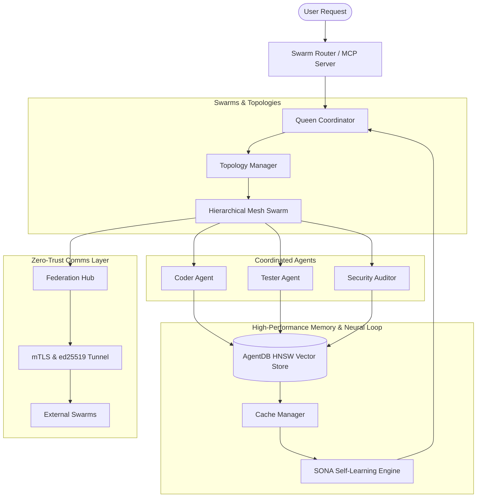

# Multi-Agent Swarm Architectures: Ruflo vs. Meow-Swarm
*A comparative review of the architectures, capabilities, and key engineering lessons.*

---

## Executive Summary

Multi-agent coordination is moving beyond simple sequential prompts. Today's state-of-the-art platforms enable dozens of specialized workers to dynamically form swarms, share high-dimensional context, and collaborate across networks. 

This document provides a deep-dive comparison between:
1. **Ruflo (formerly Claude Flow)**: A highly-modular, WASM-powered, zero-trust federated swarm orchestration platform.
2. **Meow-Swarm (Meow)**: A self-healing, quality-gated background coding harness designed for local terminal execution and crash-safe SQLite checkpointing.

By examining where **Ruflo** excels and where **Meow** falls short, we extract key engineering insights to transform Meow from a local utility into a production-grade multi-agent engine.

---

## 1. Architectural Overview

### Ruflo: The Hive-Mind Federated Mesh
Ruflo adopts a highly decoupled, domain-driven design (DDD) microkernel architecture. It treats agents, memory, and security as pluggable systems that integrate directly with **Claude Code** via the Model Context Protocol (MCP). 

Its coordination engine utilizes a hierarchical mesh topology where a central **Queen Coordinator** distributes atomic workloads to specialized worker agents, synchronizing state via distributed consensus protocols (Raft, Gossip).



### Meow-Swarm: The Sequential Quality Gate
Meow is structured around a centralized L1-L4 pipeline (L1 Liaison $\rightarrow$ L2 Architect $\rightarrow$ L3 Swarm $\rightarrow$ L4 Auditor). It operates locally using `better-sqlite3` and `sqlite-vec` to persist run states. 

It excels at quality gating (forcing code through strict post-hoc lint, compilation, and regex checks) and offers a terminal dashboard (TUI) to monitor execution. However, its coordination model is flat, in-memory, and localized to a single machine.

```mermaid
graph TD
    User([meow -p "task"]) --> L1[L1 Liaison: Human Escalation]
    L1 --> L2[L2 Architect: Task Decomposition]
    L2 --> L3[L3 SwarmManager: Parallel/Sequential Summoner]
    
    subgraph "Execution Layer"
        L3 --> Swarm[Swarm Pool]
        Swarm --> W1[Claude Code Subprocess]
        Swarm --> W2[BrowserOS VM]
        Swarm --> W3[Aider Wrapper]
    end
    
    subgraph "Quality Gating & State Store"
        W1 & W2 & W3 --> Reviewer[Mission Reviewer: 7 Criteria]
        Reviewer --> Gate{Quality Pass?}
        Gate -- Fail --> L3
        Gate -- Pass --> L4[L4 Auditor: Verification]
        L3 & Reviewer --> SQLite[(SQLite Checkpoints & sqlite-vec)]
    end
    
    L3 --> TUI[Blessed Terminal TUI]
```

---

## 2. Dimension-by-Dimension Comparison

| Architecture Dimension | Ruflo | Meow-Swarm | The Verdict |
| :--- | :--- | :--- | :--- |
| **Swarm Coordination** | 15-agent hierarchical mesh with Raft & Gossip consensus | Centralized, in-memory Map coordination with advisory lock manager | **Ruflo wins** on scalability, resilience, and mathematical coordination. |
| **Memory Engine** | Shared `AgentDB` vector store with HNSW indexing (150x-12,500x speedup) | Local SQLite vector extension (`sqlite-vec`) for database lookup | **Ruflo wins** on speed, throughput, and large-scale semantic retrieval. |
| **Security & Privacy** | ed25519-signed mTLS handshakes + automatic 14-type PII stripping pipeline | No network boundary security, basic local command sanitization | **Ruflo wins** on production readiness, compliance, and enterprise data safety. |
| **Dynamic Learning** | SONA self-learning neural architecture that adapts topologies based on history | Conceptual stubs (`evolve.ts`, `quantum_reasoning.ts`) without data-driven loop | **Ruflo wins** on self-optimizing capabilities. |
| **Extension Model** | Pluggable microkernel marketplace with 33+ npm-compatible plugins | Monolithic import structure compiling all specialist adapters together | **Ruflo wins** on developer experience, extensibility, and custom plugin creation. |
| **UIs & Planning** | GOAP A* Goal Planner (`goal.ruv.io`) and multi-model parallel tool Chat (`flo.ruv.io`) | Local Bless-based terminal TUI dashboard | **Comparable** for local debugging, but **Ruflo dominates** for enterprise monitoring. |

---

## 3. What Ruflo is Doing Well (The Gold Standard)

### A. Zero-Trust Agent Federation
Ruflo has solved a key problem in enterprise AI engineering: **How do agents securely collaborate across separate trust domains without leaking sensitive data?**
* **mTLS Tunneling**: Ruflo utilizes an ed25519 challenge-response identity model, enabling agents on different machines or cloud regions to establish encrypted peer connections natively.
* **PII-Redaction Gateway**: Outbound agent messages pass through an automated 14-type detection pipeline (emails, SSNs, AWS credentials, API keys) which scrubs, hashes, or blocks records based on peer trust levels before packet transmission.

### B. High-Performance HNSW Vector Memory
Rather than standard database scans, Ruflo incorporates **AgentDB** backed by Hierarchical Navigable Small World (HNSW) graphs. 
* This provides sub-millisecond similarity search speeds, representing a **150x to 12,500x execution improvement** over traditional brute-force cosine similarity checks.
* It enables swarms to instantly share global context, retrieve past successful trajectories, and prevent redundant LLM context-window bloating.

### C. Mathematical Swarm Consensus
Multi-agent systems often suffer from "agent drift" where individual workers overwrite each other's files or reach conflicting conclusions.
* Ruflo prevents this by implementing formal consensus algorithms (Raft and Gossip consensus).
* The swarm doesn't just run; it registers structured proposals, collects ed25519-signed votes from specialized agents, and executes modifications *only* when consensus is reached.

### D. Self-Optimizing Neural Architecture (SONA)
Instead of hardcoding which agent handles which file, Ruflo uses a closed-loop neural pattern:
* It analyzes previous task execution histories, stores success rates in a local cache, and dynamically adjusts its swarm topology to pair the most efficient agents for specific tasks.

---

## 4. What Meow is Not Doing Well (The Gaps)

> [!WARNING]
> While Meow-Swarm offers an excellent, lightweight background worker loop for individual developers, it lacks the architectural robustness required for large-scale, concurrent, or multi-developer team environments.

### A. Advisory, Unenforced Local Lock Management
In [SwarmManager.ts](file:///c:/Users/stanc/github/meow/src/swarm/SwarmManager.ts) and [ParallelExecutor.ts](file:///c:/Users/stanc/github/meow/src/orchestrator/ParallelExecutor.ts), Meow attempts to parallelize execution. However, task claiming and file coordination are purely in-memory:
* **The File Lock Gap**: The `FileCoordinator` detects path conflicts, but the orchestrator does not block them. Multiple parallel worker processes can read and write to the same files concurrently, leading to silent git conflict corruption.
* **The Crash Recovery Gap**: Since parallel coordination states are kept in memory rather than atomically in a persistent SQLite transaction, a system crash or process exit leaves half-completed sessions orphaned and locks corrupted.

### B. "Quantum" Conceptual Stubs vs. Real Mechanics
Meow is full of high-concept files like [quantum_memory.ts](file:///c:/Users/stanc/github/meow/src/agent/quantum_memory.ts) and [quantum_reasoning.ts](file:///c:/Users/stanc/github/meow/src/agent/quantum_reasoning.ts).
* While these files contain interesting heuristics (such as simulating Grover's search or Bell-state entanglement), they act as **conceptual stubs**.
* They do not participate in a practical, telemetry-driven learning loop. They consume CPU cycle overhead simulating mathematical equations without leveraging actual, historical task metrics.

### C. Monolithic Extensibility
Meow-Swarm bundles all its specialist summoners together.
* To add a new agent, a developer must modify the core [summoner.ts](file:///c:/Users/stanc/github/meow/src/agent/summoner.ts) code.
* There is no notion of a pluggable API or plugin-system contract (like Ruflo's MCP-first microkernel structure). This severely limits the open-source community's ability to build and share custom specialists.

### D. Lack of Trust Boundaries & Data Safety
Meow assumes a single developer running locally.
* If a specialist (like `BrowserOS`) makes an external network call, there are no guardrails, no PII scanners, and no trust levels.
* Standard environment secrets (`ANTHROPIC_API_KEY`) can easily leak to external pages or terminal output during error logs.

---

## 5. Key Lessons & Actionable Roadmap for Meow

To bridge these architectural gaps, Meow-Swarm can adopt the following five engineering blueprints from Ruflo's success:

### Lesson 1: Transition to Atomic SQLite Task Claiming

> [!IMPORTANT]
> Replace the in-memory Map coordination with an atomic, transactional SQLite Swarm Database.

* **How to implement**: Create a `SwarmDatabase` system modeled after Kitchen/Ruflo. Instead of local Maps, write/claim tasks using `sqlite3`'s `BEGIN IMMEDIATE` transactions:
  ```sql
  -- Atomic claim of a task by an L3 worker session
  UPDATE swarm_tasks 
  SET claimed_by = ?session_id, status = 'running', claimed_at = ?now
  WHERE id = ?task_id AND status = 'pending';
  ```
* **Benefits**: Instant recovery. If Meow dies mid-execution, a new process checks the SQLite database, detects orphaned heartbeats, recovers the locks, and resumes immediately.

### Lesson 2: Enforce the File Lock Gate
* **How to implement**: In [ParallelExecutor.ts](file:///c:/Users/stanc/github/meow/src/orchestrator/ParallelExecutor.ts), wrap the agent summon execution inside a blocking gateway:
  ```typescript
  const access = await this.fileCoordinator.requestAccess(task.id, task.requiredFiles);
  if (!access.allowed) {
    // Return to the SQLite queue with an exponential backoff retry
    await this.queue.requeueWithDelay(task.id);
    return;
  }
  ```
* **Benefits**: Eliminates multi-process workspace corruption, guaranteeing concurrent safety when scaling worker pools.

### Lesson 3: Move from conceptual "Quantum" stubs to telemetry-driven performance metrics
* **How to implement**: Replace the mathematical simulations in `quantum_memory.ts` with telemetry. Track real operational metrics per agent session:
  * LLM token cost (cents)
  * Execution duration (ms)
  * Reviewer score (0.0 to 1.0 from MissionReviewer)
  * File diff sizes
* **Benefits**: Creates a concrete dataset. Meow can use these performance vectors in local SQLite databases to dynamically select the cheapest model tier (Haiku vs. Sonnet vs. Opus) based on complexity.

### Lesson 4: Decouple Specialists with a Plugin System
* **How to implement**: Build a microkernel core. Expose an `AgentSpecialist` interface:
  ```typescript
  export interface AgentSpecialist {
    id: string;
    capabilities: string[];
    summon(context: SummonContext): Promise<SummonResult>;
  }
  ```
  Allow developers to drop pluggable agent manifests into a dedicated `./plugins/` directory, registering them automatically via a dynamic loader.
* **Benefits**: Enables rapid open-source scaling without polluting the core codebase.

### Lesson 5: Incorporate PII Filtering on Output Logs
* **How to implement**: Add a regex-based sanitation pipeline inside [MeowDatabase.ts](file:///c:/Users/stanc/github/meow/src/kernel/database.ts) and console logging handlers.
* **Benefits**: Protects the developer's credentials and repository keys from accidentally entering SQLite records, public terminal output, or cloud telemetry.
